# 🌍 Dream Vacation App – Terraform Infrastructure Deployment (AWS EC2 with CI/CD)

## Overview

In this project, I deployed the Dream Vacation App on AWS EC2 using Terraform and a full CI/CD pipeline. My goal was to create a scalable, secure, and monitored infrastructure while automating the deployment of frontend and backend services.

This README outlines my approach, configuration, and workflow, walking through everything from networking setup to launching the app and verifying it in the browser.

## Objectives

This is my Dream Vacation App, a full-stack project that I deployed on AWS EC2 using Terraform for infrastructure provisioning and my existing CI/CD pipeline. The goal of this task was to gain hands-on experience with:

- AWS Networking (VPC, Subnet, Internet Gateway, Route Tables)
- EC2 instance setup
- Docker & Docker Compose for containerized deployment
- CI/CD pipelines with GitHub Actions to automate deployment
- CloudWatch monitoring for system metrics like CPU utilization

By the end of this project, I successfully provisioned the AWS infrastructure, deployed both the frontend and backend containers, and accessed my application via the EC2 public IP while ensuring the system was fully monitored and automated.

##  🏗️ Project Structure
Here’s how my project is organized
```bash

Dream-Vacation-App/
├── backend/ 
│   ├── Other files
│   └── Dockerfile 
├── frontend/ 
│   ├── Other files
│   └── Dockerfile
├── terraform/
│   ├── main.tf
│   ├── output.tf
│   ├── provider.tf
│   ├── variables.tf
│   └── .gitignore
├── .github/workflows
│   ├── backend.yml
│   ├── frontend.yml
│   ├── terraform-deploy.yml
│   └── deploy.yml
├── docker-compose.yml
├── README.md
├── screenshots
└── Other files
```

## Process

The processes involved in this stage were:
- Provision AWS networking resources using Terraform (VPC, Subnet, IGW, Route Tables)
- Launch an EC2 instance and install Docker & Docker Compose
- Configure CloudWatch for monitoring EC2 metrics and set up alarms
- Update the CI/CD pipeline to automatically deploy the Dream Vacation App
- Run the application (frontend + backend) successfully and verify it in a browser

## 🏗 Infrastructure Setup
I structured the Terraform deployment into networking, EC2 setup, and monitoring.

### ⚡ Part 1 – Networking Setup

Before launching my EC2 instance, I provisioned the network infrastructure using Terraform. This ensured my app would have proper connectivity and security.

### Steps I Followed:
1. Created custom VPC
 - Name: `dream-vpc`
 - CIDR Block: `10.0.0.0/16`
   
2. Created Subnet
 - Name: `dream-subnet`
 - CIDR Block: `10.0.1.0/24`
 - Associated with `dream-vpc`.
   
3. Created Internet Gateway
 - Name: `dream-igw`
 - Attached to `dream-vpc` to allow external access.
   
4. Created Route Table
 - Name: dream-rt.
 - Associated with `dream-subnet`.
 - Added route to `0.0.0.0/0` via `dream-igw` for internet access.

### 1. Networking (VPC, Subnet, IGW, Route Table)
I wrote Terraform code to provision a secure and well-structured network:
```bash
# VPC
resource "aws_vpc" "main" {
  cidr_block = var.vpc_cidr
  tags = {
    Name = "${var.project_name}-vpc"
  }
}

# Subnet
resource "aws_subnet" "main" {
  vpc_id                  = aws_vpc.main.id
  cidr_block              = var.subnet_cidr
  availability_zone       = "${var.aws_region}a"
  map_public_ip_on_launch = true
  tags = {
    Name = "${var.project_name}-subnet"
  }
}

# Internet Gateway
resource "aws_internet_gateway" "main" {
  vpc_id = aws_vpc.main.id
  tags = {
    Name = "${var.project_name}-igw"
  }
}

# Route Table
resource "aws_route_table" "main" {
  vpc_id = aws_vpc.main.id
  tags = {
    Name = "${var.project_name}-rt"
  }
}

resource "aws_route" "default" {
  route_table_id         = aws_route_table.main.id
  destination_cidr_block = "0.0.0.0/0"
  gateway_id             = aws_internet_gateway.main.id
}

# Associate Route Table
resource "aws_route_table_association" "main" {
  subnet_id      = aws_subnet.main.id
  route_table_id = aws_route_table.main.id
}
```
📸 Screenshots included for VPC and Subnet in AWS console

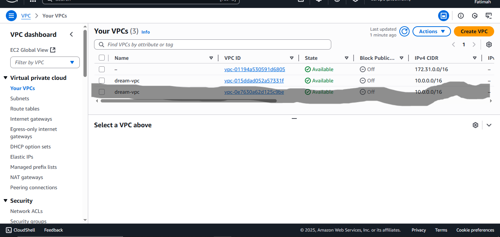
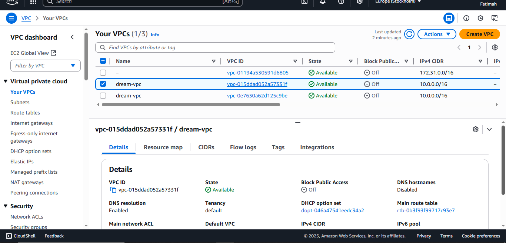
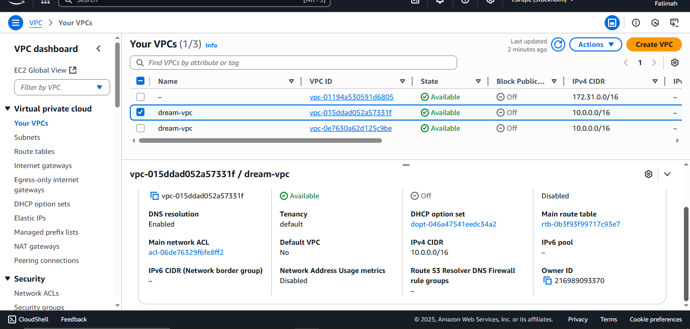
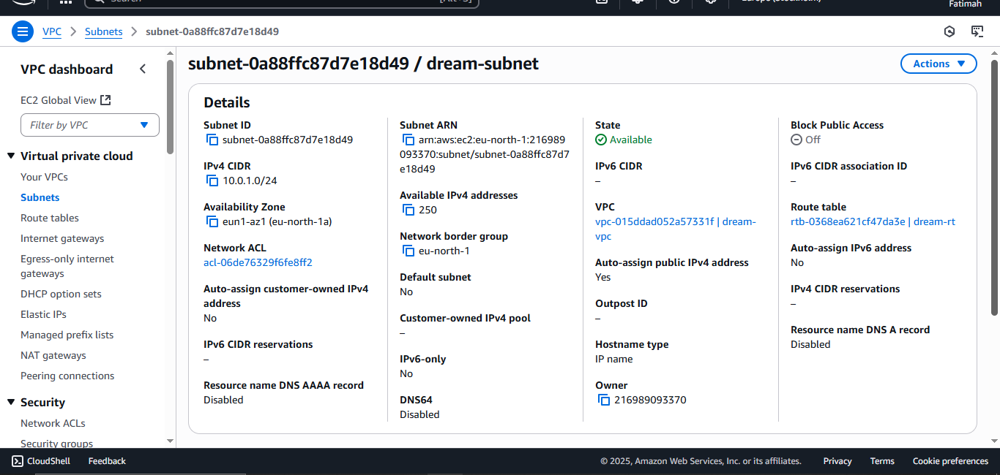

> Completing the network setup ensures that EC2 instances have internet access and are properly isolated.


### 2.EC2 Instance Deployment
Next, I provisioned an EC2 instance using Terraform to host the Dream Vacation App.
#### Instance Details
- AMI: Latest Ubuntu LTS
- Instance Type: t2.micro
- Security Group: Allow ports 22 (SSH), 80 (HTTP)
- User Data Script: Install Docker, Docker Compose, and configure CloudWatch
#### Configuration Steps
- Launch EC2 instance in dream-subnet.
- Connect via SSH:
```bash
ssh -i dream-key.pem ubuntu@<EC2_PUBLIC_IP>
```
#### Installed Docker & Docker Compose
```bash
#!/bin/bash
sudo apt-get update -y
sudo apt-get install -y docker.io docker-compose
sudo systemctl start docker
sudo systemctl enable docker
```
#### Verified Installation
```bash
docker --version
docker-compose --version
```
I provisioned an EC2 instance using Terraform and automated configuration using user data scripts:
```bash
# EC2 Instance
resource "aws_instance" "ec2" {
  ami                         = data.aws_ami.ubuntu.id
  instance_type               = var.instance_type
  key_name                    = var.key_name
  subnet_id                   = aws_subnet.main.id
  vpc_security_group_ids      = [aws_security_group.ec2_sg.id]
  associate_public_ip_address = true
  iam_instance_profile        = aws_iam_instance_profile.ec2_profile.name  # Add this line
  depends_on = [ aws_internet_gateway.main ]

  
  
  user_data = <<EOF
#!/bin/bash
apt-get update
apt-get install -y docker.io docker-compose

# Start and enable Docker
systemctl start docker
systemctl enable docker
usermod -aG docker ubuntu

# Install CloudWatch Agent
wget https://s3.amazonaws.com/amazoncloudwatch-agent/ubuntu/amd64/latest/amazon-cloudwatch-agent.deb
dpkg -i -E ./amazon-cloudwatch-agent.deb

# Create CloudWatch Agent config
cat > /opt/aws/amazon-cloudwatch-agent/etc/amazon-cloudwatch-agent.json << 'EOL'
{
  "agent": {
    "metrics_collection_interval": 60,
    "run_as_user": "cwagent"
  },
  "metrics": {
    "namespace": "CWAgent",
    "metrics_collected": {
      "cpu": {
        "measurement": [
          "cpu_usage_idle",
          "cpu_usage_iowait",
          "cpu_usage_user",
          "cpu_usage_system"
        ],
        "metrics_collection_interval": 60,
        "totalcpu": false
      },
      "disk": {
        "measurement": [
          "used_percent"
        ],
        "metrics_collection_interval": 60,
        "resources": [
          "*"
        ]
      },
      "mem": {
        "measurement": [
          "mem_used_percent"
        ],
        "metrics_collection_interval": 60
      }
    }
  }
}
EOL

# Start CloudWatch Agent
/opt/aws/amazon-cloudwatch-agent/bin/amazon-cloudwatch-agent-ctl -a fetch-config -m ec2 -c file:/opt/aws/amazon-cloudwatch-agent/etc/amazon-cloudwatch-agent.json -s
EOF
 
  tags = {
    Name = "${var.project_name}-ec2"
  }
}
``` 
📸 Screenshot of running EC2 attached

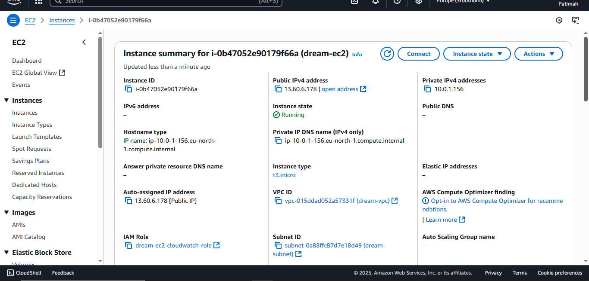
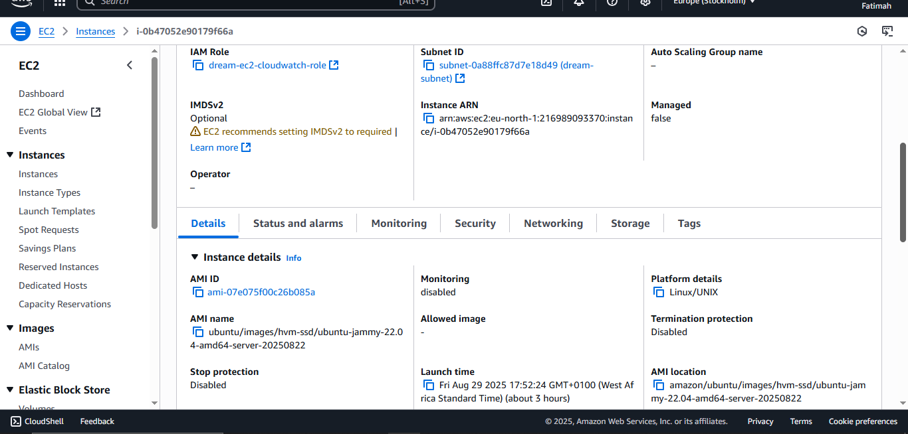
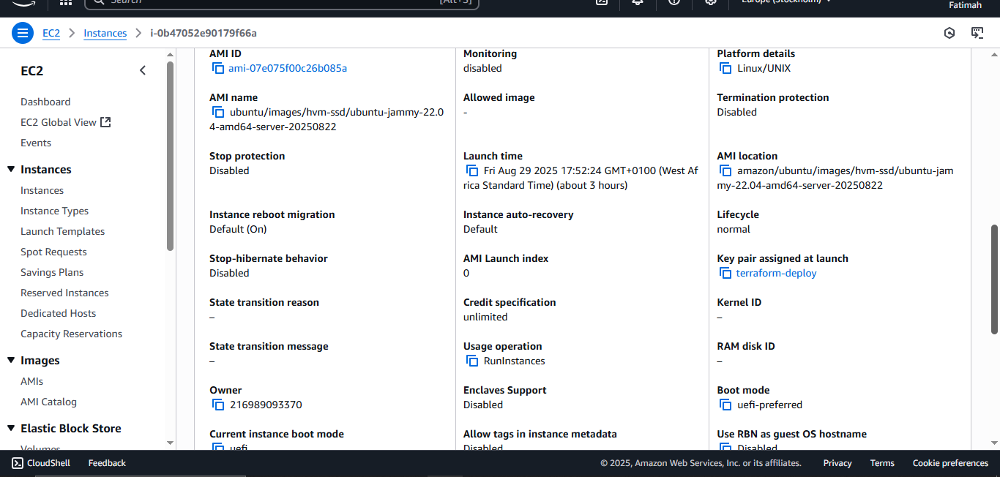
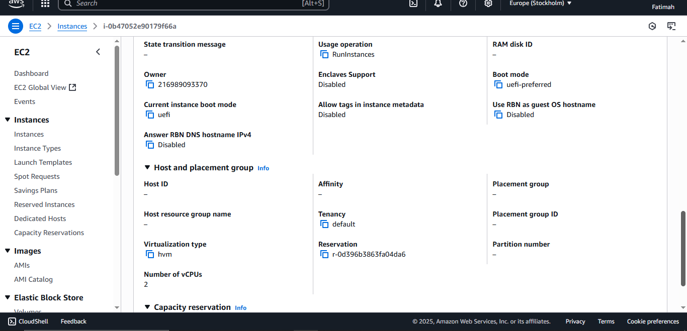


> Docker and Docker Compose allow me to run both frontend and backend containers efficiently.
  
### 3. CloudWatch Monitoring
I configured CloudWatch to monitor CPU utilization and set up alarms to alert when usage exceeds 70% for 2 consecutive minutes. To ensure the EC2 instance was properly monitored:
```bash
# CloudWatch Alarm
resource "aws_cloudwatch_metric_alarm" "cpu_alarm" {
  alarm_name          = "${var.project_name}-high-cpu"
  comparison_operator = "GreaterThanThreshold"
  evaluation_periods  = 2
  metric_name         = "CPUUtilization"
  namespace           = "AWS/EC2"
  period              = 60
  statistic           = "Average"
  threshold           = 70
  alarm_description   = "Trigger if CPU > 70% for 2 minutes"
  dimensions = {
    InstanceId = aws_instance.ec2.id
  }
}

# IAM Role for EC2 to access CloudWatch
resource "aws_iam_role" "ec2_cloudwatch_role" {
  name = "${var.project_name}-ec2-cloudwatch-role"

  assume_role_policy = jsonencode({
    Version = "2012-10-17"
    Statement = [
      {
        Action = "sts:AssumeRole"
        Effect = "Allow"
        Principal = {
          Service = "ec2.amazonaws.com"
        }
      }
    ]
  })
}

# Attach CloudWatch Agent Server Policy
resource "aws_iam_role_policy_attachment" "cloudwatch_agent_policy" {
  role       = aws_iam_role.ec2_cloudwatch_role.name
  policy_arn = "arn:aws:iam::aws:policy/CloudWatchAgentServerPolicy"
}

# Instance Profile
resource "aws_iam_instance_profile" "ec2_profile" {
  name = "${var.project_name}-ec2-profile"
  role = aws_iam_role.ec2_cloudwatch_role.name
}
```

📸 Screenshot of CloudWatch CPU metrics/alarms

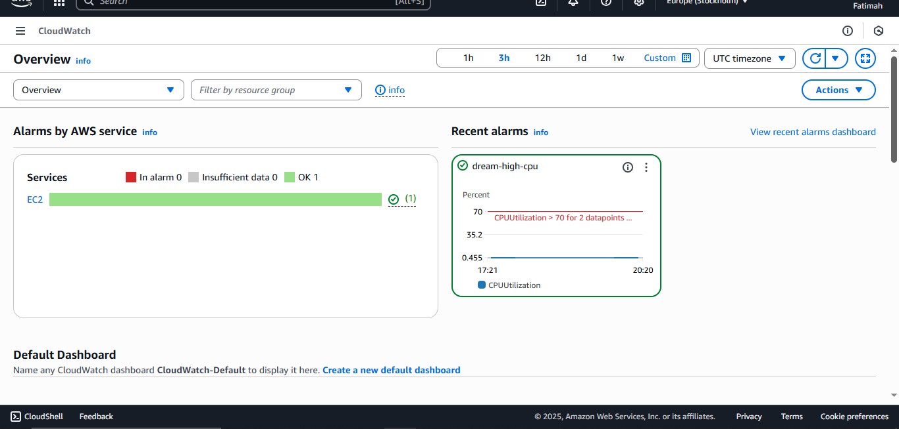
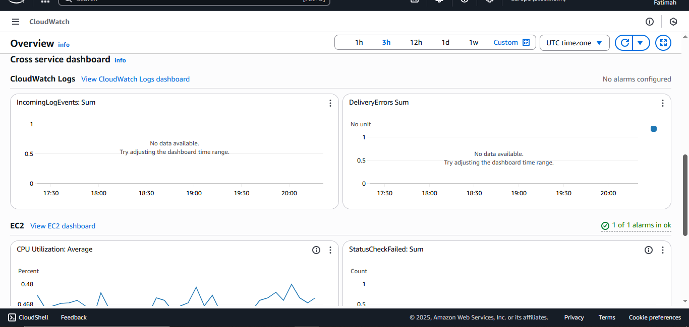
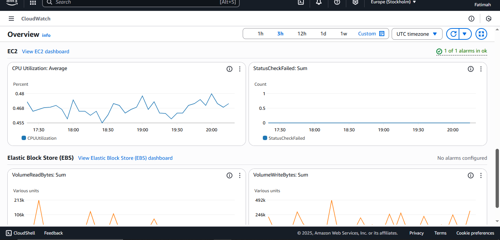
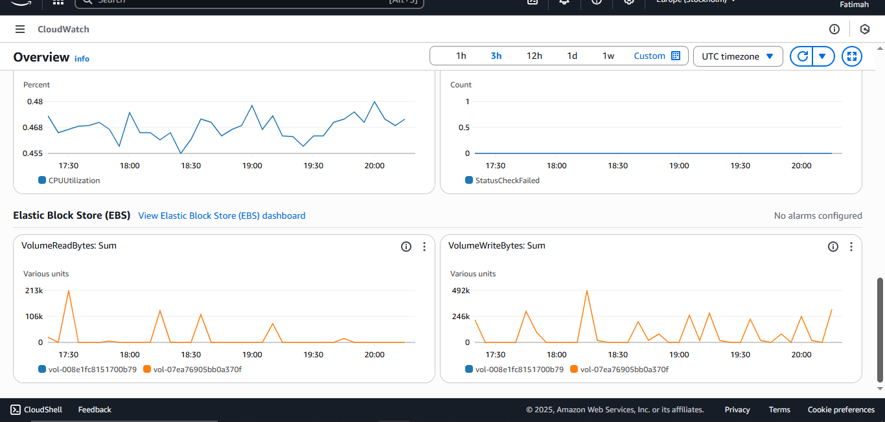


### ⚡ Part 3 – CI/CD Deployment

With infrastructure ready, I automated deployment using my GitHub Actions pipeline.

#### Existing Pipeline
- Builds Docker images for frontend and backend
- Pushes images to Docker Hub

#### Updated Pipeline for EC2 Deployment
- SSH into EC2 instance
- Copy docker-compose.yml and app code
- Pull latest Docker images
- Run containers using Docker Compose
   
``` bash
 deploy:
    needs: terraform
    runs-on: ubuntu-latest
 
    steps:
      - name: Checkout code
        uses: actions/checkout@v4
       # Install netcat
      - name: Install netcat
        run: sudo apt-get update && sudo apt-get install -y netcat-openbsd

    # Wait until SSH is available
      - name: Wait for EC2 SSH
        env:
          EC2_IP: ${{ needs.terraform.outputs.ec2_ip }}
        run: |
          echo "⏳ Waiting for SSH on $EC2_IP:22..."
          for i in {1..30}; do
          if nc -zv $EC2_IP 22; then
            echo "✅ SSH is ready!"
            exit 0
          fi
          echo "Retrying in 10s... ($i/30)"
          sleep 10
          done
          echo "❌ Timeout: SSH not available after 5 minutes"
          exit 1

     
```
Alternatively, I could also manually run the deployment with:

``` bash
ssh -i C:\Users\User\.ssh\dream-key.pem ubuntu@<EC2_PUBLIC_IP> << 'EOF'
cd /home/ubuntu/Dream-Vacation-App
docker-compose pull
docker-compose up -d
EOF
```

📸 Screenshots of CI/CD pipeline logs, showing successful Terraform deployment + app deployment.

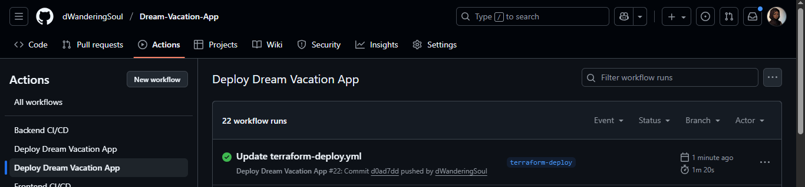
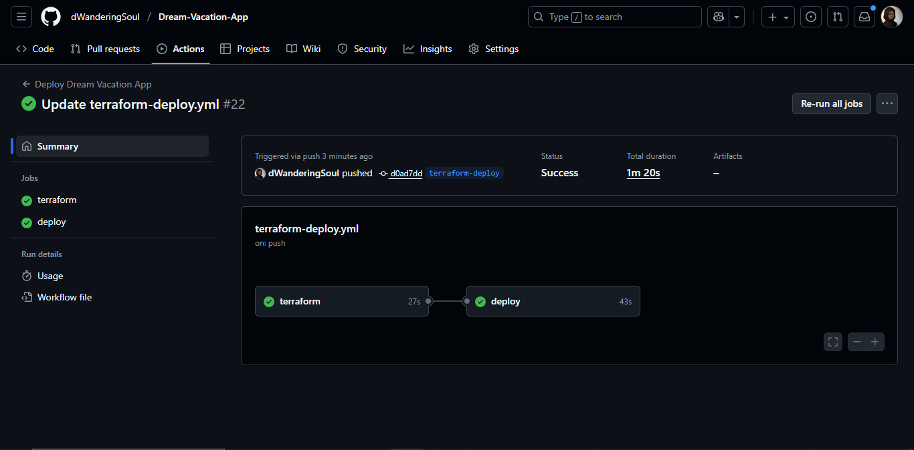


> Automation ensures any GitHub push updates the app on EC2 without manual steps.


### ✅ Part 4 – Testing Deployment

After the pipeline ran successfully, I verified that both the frontend and backend of the Dream Vacation App were properly deployed and running on the EC2 instance.

#### 🌐 Application Endpoints
 - Frontend: http://<EC2_PUBLIC_IP>:80
 - Backend API: http://<EC2_PUBLIC_IP>:5000
For my deployment:
 - Frontend → http://13.60.6.178:80 or http://13.60.6.178
 - Backend → http://13.60.6.178:3001

#### 📝 Things I Checked
 - ✅ Docker containers are running properly using:
```bash
docker ps
```
 - ✅ Ports 3000 (frontend) and 5000 (backend) are open in the EC2 security group.
 - ✅ Frontend renders correctly in the browser.
 - ✅ Backend API responds successfully using Postman or browser requests.

📸 Screenshot of the running app in the browser attached.

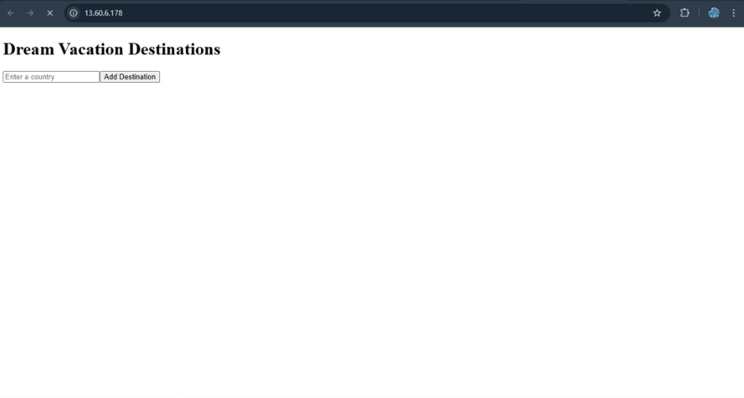


### 🚀 Conclusion

By following this process, I successfully deployed the Dream Vacation App on AWS EC2 using Terraform and a CI/CD pipeline. Both frontend and backend services are publicly accessible, containerized, and monitored via CloudWatch.

#### 🌟 Key Learnings
This project gave me valuable hands-on experience in:
- Provisioned AWS networking (VPC, subnet, IGW, route tables)
- Launched and configured EC2 for containerized apps
- Deployed full-stack app with Docker & Docker Compose
- Automated deployments via CI/CD pipelines
- Configured CloudWatch for monitoring and alerts

This project strengthened my understanding of end-to-end cloud deployment, infrastructure as code, automation and monitoring in a practical DevOps workflow.


