# 🌍 Dream Vacation App – AWS EC2 Deployment with CI/CD

## Overview

I’m sharing my process for deploying the Dream Vacation App to AWS EC2 using the AWS Management Console (ClickOps) and my existing CI/CD pipeline. This project is part of my DevOps beginner journey and I’ll walk through everything step by step—from setting up networking to launching the app and verifying it in the browser.

## Objectives

This is my Dream Vacation App, a full-stack project that I deployed on AWS EC2 using ClickOps and my existing CI/CD pipeline.
The goal of this task was to gain hands-on experience with:

 - AWS Networking (VPC, Subnet, IGW, Route Tables).

 - EC2 instance setup.

 - Docker & Docker Compose for containerized deployment.

 - CI/CD pipelines with GitHub Actions to automate deployment.

By the end of this project, I successfully provisioned AWS resources, deployed both the frontend and backend containers and accessed my application using the EC2 public IP as well as externally.

##  🏗️ Project Structure
Here’s how my project is organized
```bash

Dream-Vacation-App/
├── backend/ 
│   ├── Other files
│   └── Dockerfile 
├── frontend/ 
│   ├── Other files
│   └── Dockerfile
├── .github/workflows
│   ├── backend.yml
│   ├── frontend.yml
│   └── deploy.yml
├── docker-compose.yml
├── README.md
├── screenshots
└── Other files
```

## Process

The processes involved in this stage were:
 - Create AWS networking manually via the AWS Console (ClickOps).
 - Launch an EC2 instance, install Docker + Docker Compose.
 - Configure CI/CD to automatically deploy to EC2
 - Run the Dream Vacation App (frontend + backend) successfully in a browser.

## Setup

### ⚡ Part 1 – Networking Setup

Before I could launch my EC2 instance, I needed to ensure the network setup was correct. Using the AWS Management Console, I created a custom Virtual Private Cloud (VPC) to isolate my application’s resources.

### Steps I Followed:
1. Created custom VPC
 - Name: `dream-vpc`
 - CIDR Block: `10.0.0.0/16`
   
2. Created Subnet
 - Name: `dream-subnet`
 - CIDR Block: `10.0.1.0/24`
 - Associated with `dream-vpc`.
   
3. Created Internet Gateway
 - Name: `dream-igw`
 - Attached to `dream-vpc` to allow external traffic.
   
4. Created Route Table
 - Name: dream-rt.
 - Associated with `dream-subnet`.
 - Added route to `0.0.0.0/0` via `dream-igw` for internet access.
   
📸 Screenshots included for VPC and Subnet in AWS console

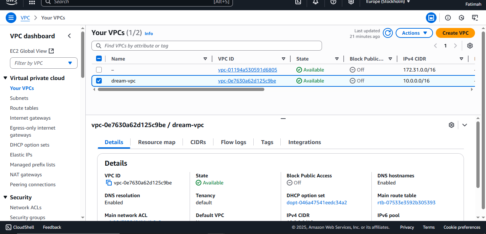
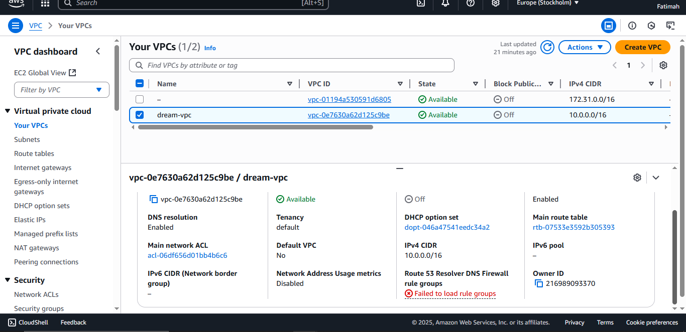
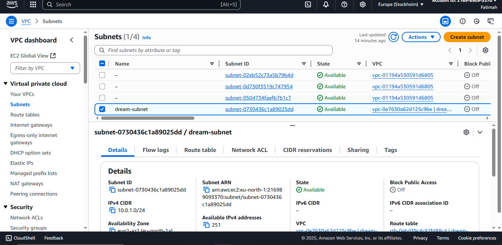
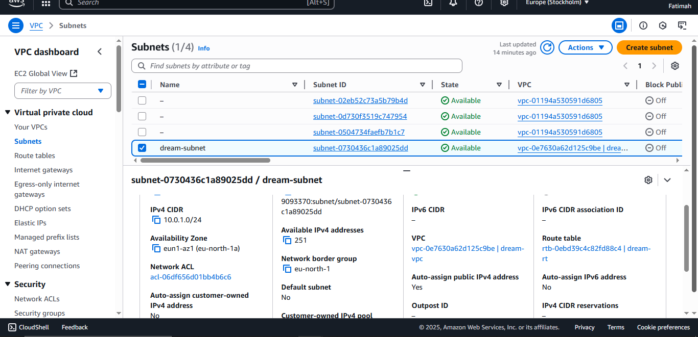
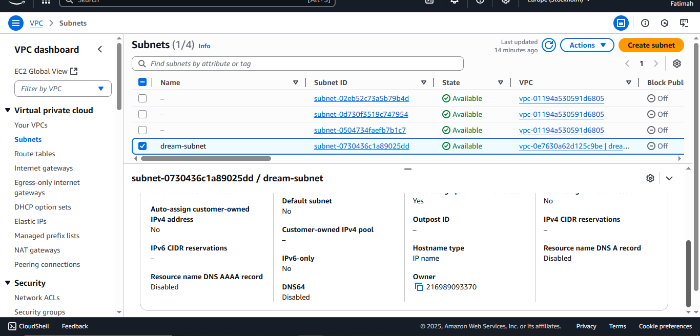

> By completing this networking setup, I ensured that my EC2 instance would have proper connectivity to the internet and that I could access it externally.


### ⚡ Part 2 – EC2 Instance Setup

Next, I launched an EC2 instance to host the Dream Vacation App.
#### Instance details
 - AMI: Ubuntu 20.04
 - Instance Type: `t2.micro`
 - Key Pair: `dream-key.pem` configured for SSH access.
 - Security Group: Allowed ports 22 (SSH), 80 (HTTP), 3000 (Frontend), 5000 (Backend).

Configuration Steps:
1. Launch the EC2 instance in the `dream-subnet` I created.
2. Connect via SSH from PowerShell on my local machine:
```bash
ssh -i C:\Users\User\.ssh\dream-key.pem ubuntu@<EC2_PUBLIC_IP>
```

#### Installed Docker & Docker Compose
I used a User Data script during launch:
 ``` bash
#!/bin/bash
sudo apt-get update -y
sudo apt-get install -y docker.io docker-compose
sudo systemctl start docker
sudo systemctl enable docker
```

#### Verified installation

```bash
docker --version
docker-compose --version
```

📸 Screenshot of running EC2 attached

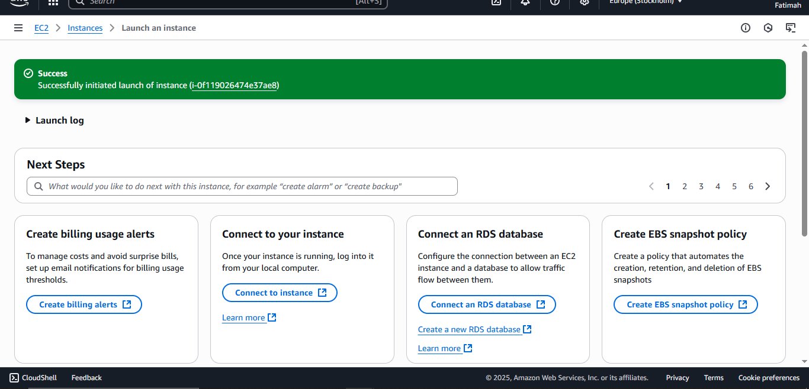
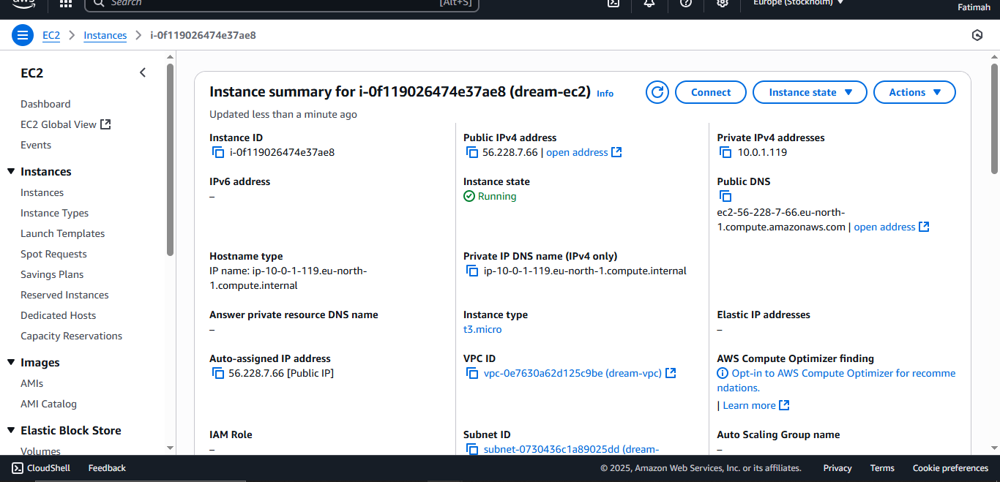
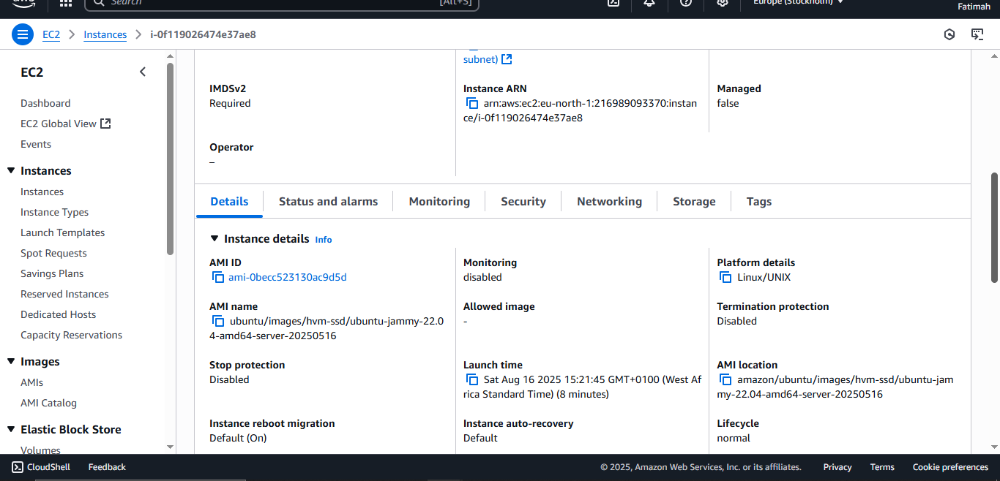
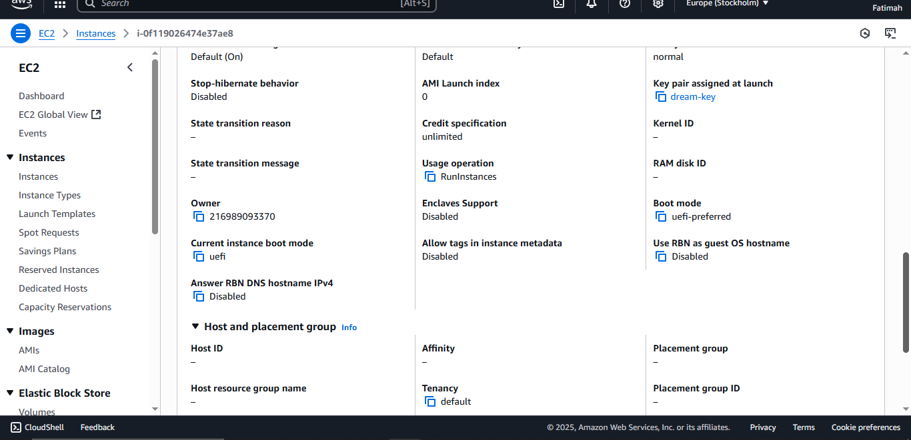
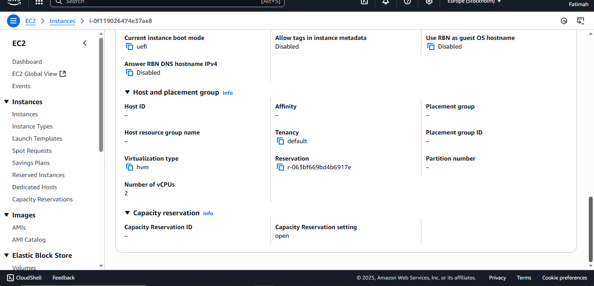

> Installing Docker ensures I can run the app containers on my EC2 instance. Docker Compose helps me orchestrate both frontend and backend services.


### ⚡ Part 3 – CI/CD Deployment

With the infrastructure ready, I moved on to deploying the Dream Vacation App using my existing CI/CD pipeline.

#### 🔄 Existing Pipeline
Before this stage, I had already set up a CI/CD pipeline that:
 - Builds Docker images for both frontend and backend.
 - Pushes these images to my container registry (Docker Hub).
I confirmed that the pipeline was green and the latest images were successfully built and pushed.

#### 🛠️ Updated Pipeline for Deployment
To automate deployment onto my EC2 instance, I updated my GitHub Actions workflow (`.github/workflows/backend.yml`, `.github/workflows/frontend.yml`) with a final deploy stage by adding (`.github/workflows/deploy.yml`).
This stage:
1. SSHs into the EC2 instance.
2. Copies the docker-compose.yml file and app code.
3. Pulls the latest Docker images.
4. Runs containers with Docker Compose.
   
``` bash
deploy:
  runs-on: ubuntu-latest
  steps:
    - name: Checkout repo
      uses: actions/checkout@v3

    - name: Deploy to EC2
      uses: appleboy/ssh-action@v0.1.6
      with:
        host: ${{ secrets.EC2_HOST }}
        username: ubuntu
        key: ${{ secrets.EC2_SSH_KEY }}
        script: |
          cd ~/dream-vacation-app
          git pull origin main
          docker-compose pull
          docker-compose up -d --build
```
Alternatively, I could also manually run the deployment with:

``` bash
ssh -i C:\Users\User\.ssh\dream-key.pem ubuntu@<EC2_PUBLIC_IP> << 'EOF'
cd /home/ubuntu/Dream-Vacation-App
docker-compose pull
docker-compose up -d
EOF
```

📸 Screenshots of CI/CD pipeline logs, Docker images on registry and SSH into EC2 instance via PowerShell attached.

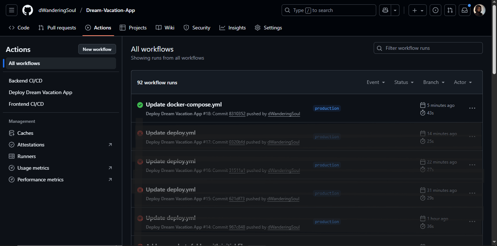
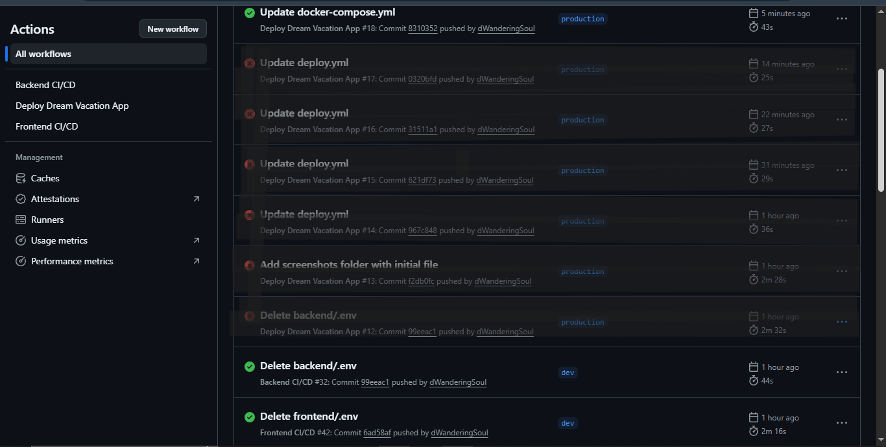
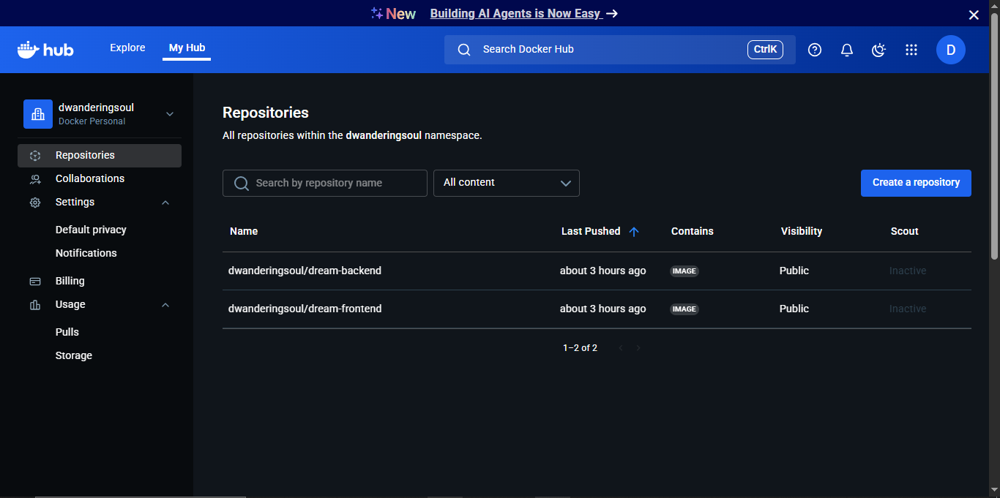
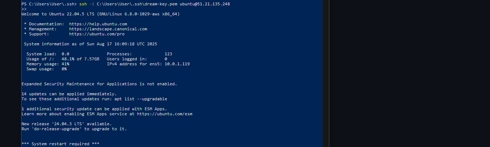

> This automation ensures that every time I push changes to GitHub, the EC2 instance automatically updates the app without manual intervention.


### ✅ Part 4 – Testing Deployment

After the pipeline ran successfully, I verified that both the frontend and backend of the Dream Vacation App were properly deployed and running on the EC2 instance.

#### 🌐 Application Endpoints
 - Frontend: http://<EC2_PUBLIC_IP>:3000
 - Backend API: http://<EC2_PUBLIC_IP>:5000
For my deployment:
 - Frontend → http://51.21.135.248:3000
 - Backend → http://51.21.135.248:5000

#### 📝 Things I Checked
 - ✅ Docker containers are running properly using:
```bash
docker ps
```
 - ✅ Ports 3000 (frontend) and 5000 (backend) are open in the EC2 security group.
 - ✅ Frontend renders correctly in the browser.
 - ✅ Backend API responds successfully using Postman or browser requests.

📸 Screenshot of the running app in the browser attached.

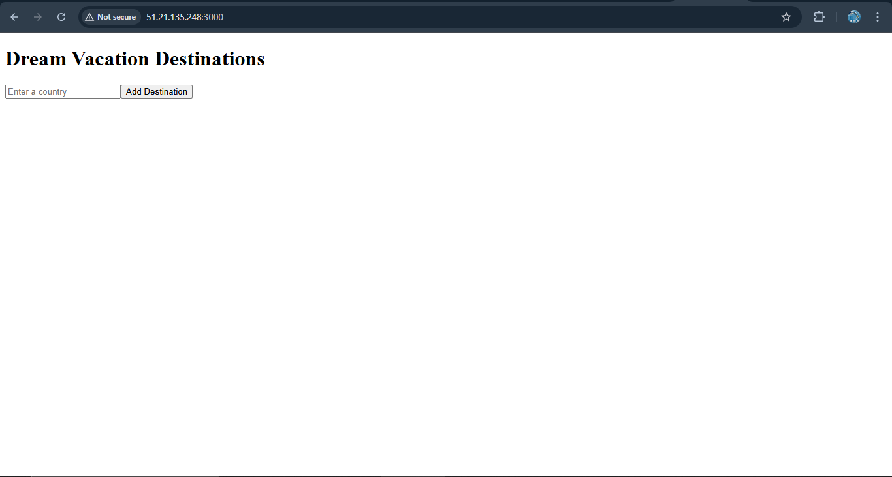


### 🚀 Conclusion

By following this process, I successfully deployed the Dream Vacation App on AWS EC2, using ClickOps for infrastructure setup and my CI/CD pipeline for automated deployment. Both the frontend and backend are now publicly accessible and running smoothly.

#### 🌟 Key Learnings
This project gave me valuable hands-on experience in:

 - Building AWS networking from scratch (VPCs, subnets, internet gateways, route tables).

 - Launching and configuring EC2 instances for containerized applications.

 - Deploying a full-stack app with Docker & Docker Compose.

 - Extending a CI/CD pipeline to automate remote deployments into AWS.

 - Troubleshooting security group configurations and port-binding issues.

Overall, this was a highly practical DevOps and cloud deployment exercise that strengthened my understanding of end-to-end infrastructure, deployment automation, and application delivery on AWS.


